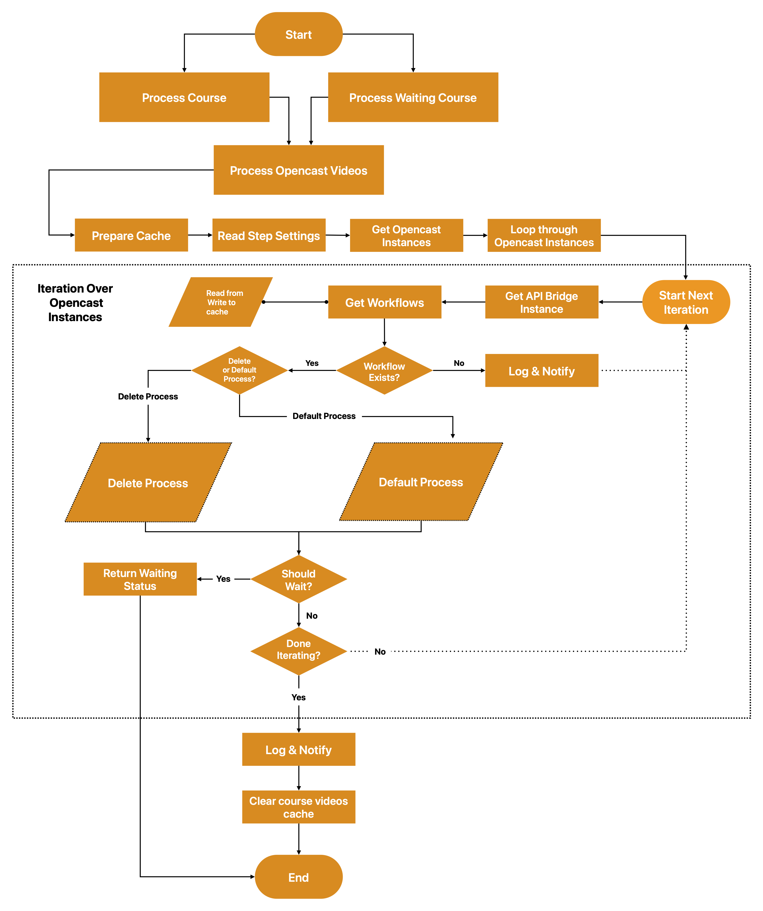
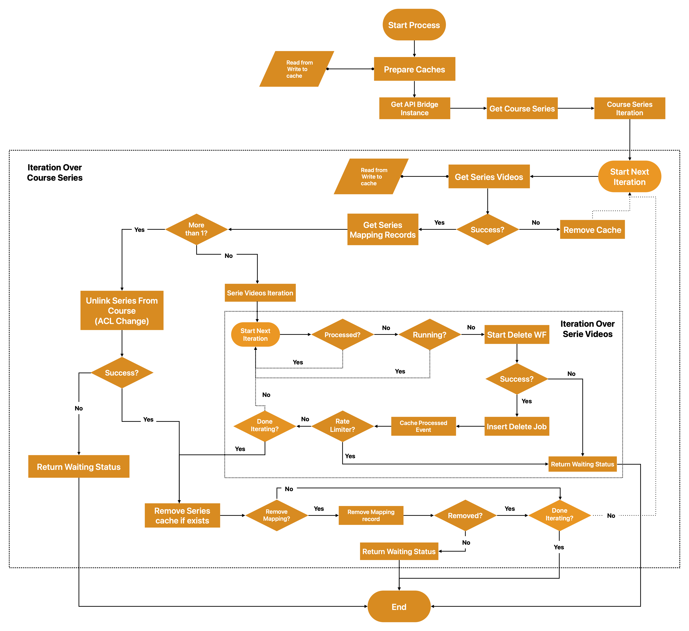
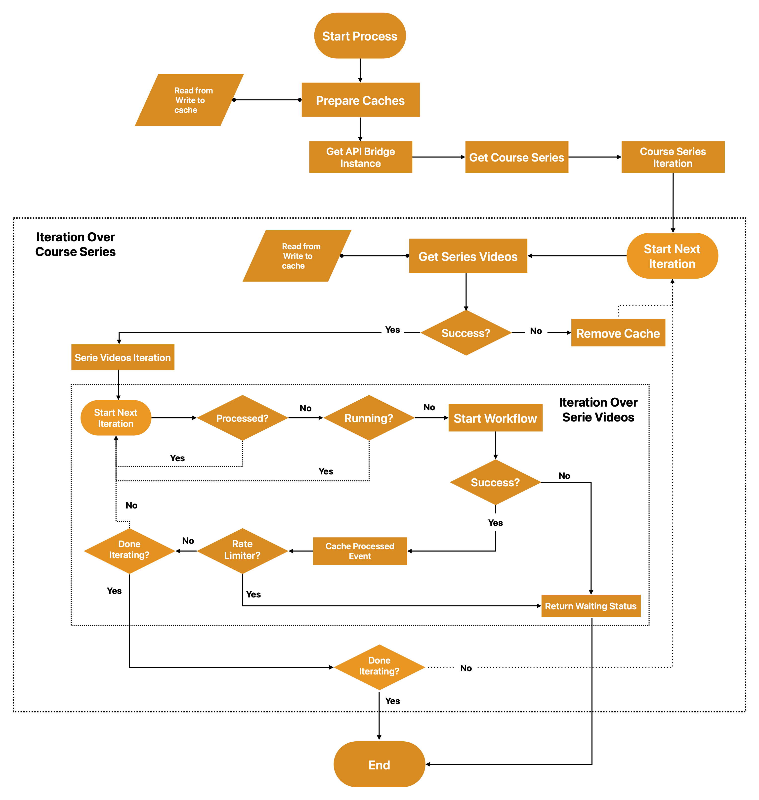
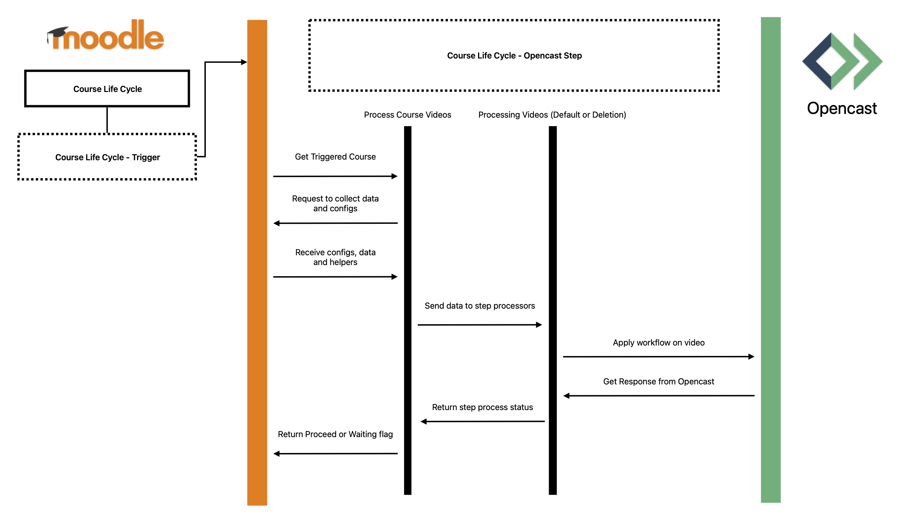

# Course Life Cycle Opencast Step (moodle-lifecyclestep_opencast)

## History

This plugin was originally developed in 2022 by Alexander Bias from [ssystems.de](https://www.ssystems.de/) on behalf of the [University of Ulm](https://www.uni-ulm.de/). It is currently maintained by [Farbod Zamani](https://github.com/ferishili) from [elan e.V.](https://elan-ev.de/).

## Requirements

* Moodle 4.5+
* Opencast 15+
* Moodle Opencast API plugin (`tool_opencast`) v4.5-r6+
* Moodle Opencast Videos plugin (`block_opencast`) v4.5-r7+
* Moodle Course Life Cycle (`tool_lifecycle`) MOODLE_405_STABLE, MOODLE_500_STABLE or MOODLE_501_STABLE

## Installation

This plugin is a subplugin of the Course Life Cycle admin tool and must be placed under `admin/tool/lifecycle/step`, however, using the Moodle Plugin installation wizard is strongly recommended.

You can obtain the main Course Life Cycle plugin from:
[https://moodle.org/plugins/view/tool_lifecycle](https://moodle.org/plugins/view/tool_lifecycle)

Make sure the main plugin is installed before installing this subplugin.

## More Information

For detailed information about step plugins, please refer to the [Wiki](https://github.com/learnweb/moodle-tool_lifecycle/wiki) of the `moodle-tool_lifecycle` admin tool.

## Description

This plugin provides a step for the [Course Life Cycle](https://github.com/learnweb/moodle-tool_lifecycle) tool.

It allows administrators to define, for each course, what should happen to the associated Opencast videos after a configurable period of time. The step can either:

* Delete the Opencast events belonging to the Moodle course, or
* Run a specific Opencast workflow on each eligible event.

The step supports both duplication modes used by the Opencast integration:

* **ACL Change** (shared course series across multiple courses)
* **Event Duplication** (standard duplication mode)

In the case of shared series using the *ACL Change* mode, the step correctly handles ACL updates as required.

## Admin Approval Flow

This step requires explicit administrator approval before any Opencast events are processed or deleted. The approval flow works as follows:

1. The lifecycle cron runs and detects a course that matches the workflow trigger conditions.
2. The course enters a **waiting state** and is listed on the Course Life Cycle interaction page.
3. An administrator navigates to the interaction page and confirms or aborts the processing for each course.
4. On the next cron run, confirmed courses are processed — Opencast events are deleted or the configured workflow is triggered.

> **Important:** The interaction page must be accessed via the Course Life Cycle **view page** (`/admin/tool/lifecycle/view.php`). It can also be reached from within a Moodle course via **More → Lifecycle Management**. Do not use the Workflow Overview page (`workflowoverview.php`) for this — the approval form is not available there.

### Admin Decision Options

On the interaction page, the administrator can choose one of the following decisions for each pending course:

* **Confirm** — the step proceeds and Opencast events are processed on the next cron run.
* **Abort** — the step is stopped for this course without making any changes in Opencast.

### Rate Limiter Behaviour

If the rate limiter is enabled, the step processes one Opencast event per cron run per course. After each event, the course returns to waiting state and must be confirmed again by an administrator before the next event is processed.

## Settings

The step automatically detects multi-tenancy configurations provided by the Opencast API plugin and applies the settings per Opencast instance accordingly.

### Opencast Instance–Specific Settings

For each configured Opencast instance, the following settings are available:

> **Note:** These settings cannot be changed while the workflow is active. To change them, deactivate the workflow first.

* **Opencast workflow tags**
  A comma-separated list of workflow tags used to filter the list of available Opencast workflows. If left empty, the default tags `delete,archive` are used. Changes to this field take effect only after saving.

* **Opencast workflow**
  Defines the Opencast workflow that will be executed for each eligible event.

* **Enable deletion process**
  If enabled, events will be deleted when a course is processed by this step. If disabled, the configured workflow will be executed instead.

* **Remove series mapping when deleting**
  If the deletion process is enabled, this option ensures that the series-to-course mapping in Moodle is also removed once all events in the series have been processed.

### General Settings

The following general settings can be changed even while the workflow is active.

* **Enable dry run**
  If enabled, the step simulates processing without making any actual changes in Opencast. All operations are logged as if they were executed, but no workflows are started and no mappings are removed. Trace logging is automatically enabled when dry run is active. Use this to verify the configuration before going live.

* **Enable trace**
  Logs and traces the entire process step by step. This setting is ignored when dry run is enabled — trace is always active in dry run mode.

* **Enable admin notification**
  Notifies administrators by Moodle message if an error occurs during processing (e.g. workflow not found, API connection failure).

* **Enable rate limiter**
  If enabled, the step processes only one Opencast event per cron run per course. This avoids overloading the Opencast server and allows the administrator to monitor processing step by step. After each event, the course returns to waiting state.

## After Processing

Once the Opencast events have been deleted, the associated Moodle activities (e.g. Opencast Video blocks or modules) are **not** automatically removed. An administrator must delete these manually from the Moodle course. After that, the lifecycle process can be proceeded to complete the workflow. Or the entire moodle course will be deleted afterwards.

## Concept

The following diagrams illustrate the overall processing logic.

### Top-Level Process

### Deletion Process

If the deletion process is enabled for an Opencast instance, processing follows this flow:

### Default Process

If the deletion process is disabled, the step executes the configured workflow for each eligible event:

### Sequence Diagram

